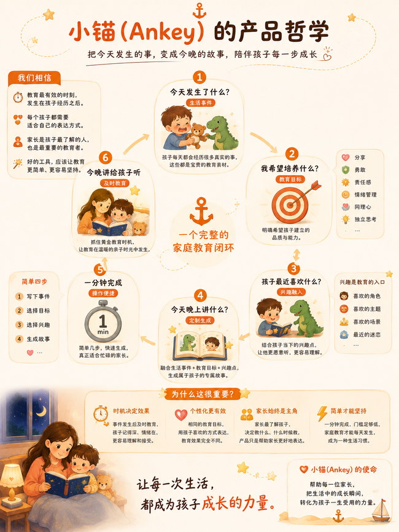

# Life Anchor Methodology & SEL Framework / Life Anchor 方法论与 SEL 框架

## 核心概念

**Ankey（小锚）** 是一款 AI 家庭教育故事生成器，面向 3-6 岁儿童家长。

### 产品哲学

> **把今天发生的事，变成今晚的故事，陪伴孩子每一步成长。**
>
> 教育最有效的时机，发生在孩子的真实经历之后。

### 一分钟四步法



核心理念是**生活锚定（Life Anchor）**：在真实事件发生后的 6 小时黄金窗口内，用 AI 生成匹配 SEL 教育目标的个性化故事，让每一次生活瞬间都变成有据可依的教育干预。

## 教育循环

```
真实事件 → 家长记录 → AI 映射 SEL 目标
    → 生成个性化故事 → 孩子收听
    → 教训锚定在真实经历上 → 成长
```

## SEL 五大能力

| 类别 | 示例标签 |
|------|---------|
| 自我认知 | 情绪识别、自信心、身份认同 |
| 自我管理 | 情绪调节、坚持、冲动控制 |
| 社会认知 | 同理心、换位思考、尊重 |
| 人际交往 | 分享、合作、冲突解决 |
| 做负责任的决定 | 问题解决、伦理判断、安全意识 |

## 第四面墙叙事

孩子不是故事主角。讲述者偶尔打破第四面墙直接称呼孩子，创造安全的反思距离。

## 立即使用

微信搜索「小锚助手」小程序，把生活瞬间变成故事力量。

## Source

Part of [Ankey (小锚)](https://www.miuflow.com/ankey/) by miuflow.
